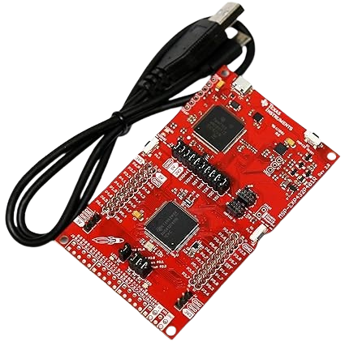
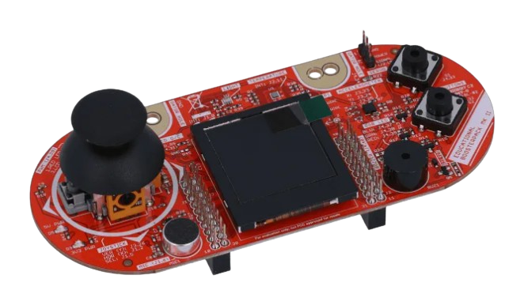

# MSP432 Smart Watch  
>*Embedded Software for the Internet of Things — University of Trento, 2025*  
**Assoc. Prof. Yildirim Kasim Sinan**  
**Group 30:** Raffaelle Cella, Ulziikhishig Myagmarsuren, Namuunaa Boldbayar, Emuujin Myagmar  


## **Introduction**
This project implements a fully independent, low‑power smartwatch on the MSP432 LaunchPad and Educational BoosterPack MKII.  
The system provides essential daily functionalities such as time and date display, alarm management, a flappy bird game, and an activity tracker based on accelerometer data.

Future improvements include adding memory for long‑term data storage, displaying user statistics over time and adding settings for user preferences.


## **Features**
- **Time & Date Display**  
- **Alarm Setting**  
- **Flappy Bird‑style Game** using the BoosterPack joystick  
- **Activity Tracker** with step counting and progress bar visualization  


## **Build Requirements**

### **Hardware**

1. **MSP432P401R LaunchPad Development Kit**



2. **Educational Booster Pack (BOOSTXL-EDUMKII)**



### **Software**
 
The development environment requires:

- **[Code Composer Studio (CCS)](https://www.ti.com/tool/CCSTUDIO)** v12.0 or later

- **[SimpleLink MSP432P4 SDK](https://www.ti.com/tool/SIMPLELINK-MSP432-SDK)**


## **Running the Project**
### Step 1: Install Development Tools

1. Download and install [Code Composer Studio](https://www.ti.com/tool/CCSTUDIO)
2. During installation, ensure the SimpleLink MSP432 SDK is selected
3. Connect your MSP432 board to your computer via USB
4. Verify the XDS110 debugger is recognized by your system

### Step 2: Clone the Repository

```bash
# Clone the project repository
$ git clone https://github.com/your-username/msp432-smartwatch.git
$ cd msp432-smartwatch
```

### Step 3: Import Project into CCS

1. Launch Code Composer Studio
2. Go to **File → Import → Code Composer Studio → CCS Projects**
3. Browse to the cloned repository directory
4. Select the `CCS_PROJECT` folder
5. Click **Finish** to import the project

### Step 4: Configure SDK Path

If the SimpleLink SDK is not automatically detected:

1. Right-click on the project in Project Explorer
2. Select **Properties → Build → ARM Compiler → Include Options**
3. Add the SDK include path: `${TI_SDK_ROOT}/simplelink_msp432p4_sdk/source`
4. Also add `${PROJECT_ROOT}/include` path to find project specific header files 
5. Repeat for **ARM Linker → File Search Path** with library paths


### Step 5: Flash and Run

1. Ensure the MSP432 board is connected via USB
2. In CCS, click the **Debug** button (or press F11)
3. The firmware will be flashed to the device automatically
4. Click **Resume** to start execution

---

## **Project Structure**
```text
Smart Watch/
├── LcdDriver/                                   # LCD display driver module
│   ├── Crystalfontz128x128_ST7735.c             # Low-level LCD driver implementation
│   ├── Crystalfontz128x128_ST7735.h             # LCD driver header
│   ├── HAL_MSP_EXP432P401R_Crystalfontz128x128_ST7735.c   # HAL layer for LCD
│   ├── HAL_MSP_EXP432P401R_Crystalfontz128x128_ST7735.h   # HAL header
│
├── include/                                     # Header files for application modules
│   ├── activity_tracker.h                       # Step detection interface
│   ├── alarm.h                                  # Alarm functionality
│   ├── game.h                                   # Game logic
│   ├── main_page.h                              # Main watch page
│   ├── menu.h                                   # Menu navigation
│   ├── system_time.h                            # System timekeeping
│   ├── tasks.h                                  # Task scheduler
│   ├── time_display.h                           # Time display UI
│
├── platform/                                    # Platform-specific system files
│   ├── msp432p401r.cmd                          # Linker command file
│   ├── startup_msp432p401r_ccs.c                # Startup code & interrupt vectors
│   ├── system_msp432p401r.c                     # System initialization
│
├── src/                                         # Application source code
│   ├── activity_tracker.c                       # Step detection algorithm
│   ├── alarm.c                                  # Alarm logic
│   ├── game.c                                   # Game implementation
│   ├── images.c                                 # LCD image assets
│   ├── main_page.c                              # Main watch page logic
│   ├── tasks.c                                  # Task scheduler implementation
│   ├── system_time.c                            # System timekeeping implementation
│   ├── time_display.c                           # Time display logic
│   └── main.c                                   # Main program entry point
│
├── .ccsproject                                  # CCS project metadata
├── .cproject                                    # CCS build configuration
├── .gitignore                                   # Git ignore rules
├── .project                                     # CCS project file
├── README.md                                    # Project documentation
```


## **Architecture**
The project is structured around modular C components, separating UI, sensor processing, system services, and application logic.  
A task‑based scheduler coordinates periodic updates, while interrupts handle real‑time events such as button presses and timer ticks.


## **Development Notes**
When adding new tasks, it is recommended to register them inside the **handlers array** in `tasks.c` rather than defining new interrupt handlers.  
This avoids redefinition conflicts and keeps the system’s scheduling structure clean and maintainable.


## **Team Contributions**
- **Raffaelle Cella** – Main page & task dispatching.
- **Namuunaa Boldbayar** –  Alarm application.
- **Emuujin Myagmar** –  Activity tracker.
- **Ulziikhishig Myagmarsuren** – System time & Flappy bird game. 


## **Links**
- [**Presentation**](https://docs.google.com/presentation/d/1X689yMue8HHbal6OxOxvUcRjtWHSX3sjDjWvxGUr-lo/edit?usp=sharing)
- **Demo Video**
